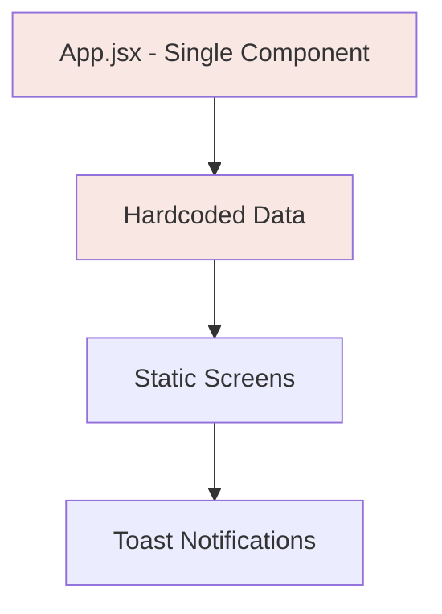
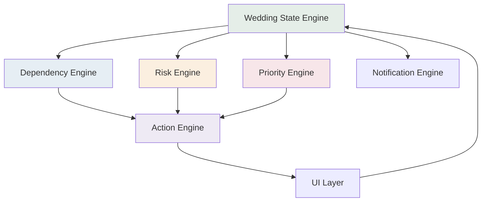

# ShaadiOS: Full Gap Analysis — BRD/PRD vs Current Prototype

## Executive Summary

The current prototype is a **solid demo shell** that covers the visual surface of about **40% of MVP requirements**. However, most of what it implements is **static/hardcoded** rather than functional. The prototype demonstrates the *idea* of each screen but does not yet implement the *system* behind those screens.

> [!IMPORTANT]
> The BRD/PRD defines **ShaadiOS as a connected system** — not a collection of pages. The current prototype has the pages but not the connections. Building the real product means building the **Wedding State → Intelligence → Action → Recalculate** loop.

---

## Coverage Summary

| BRD/PRD Area | Specification Sections | Current Status | Gap Level |
|---|---|---|---|
| **A. Product Strategy** | §1–9 | ✅ Aligned in intent | Low |
| **B. BRD** | §10–15 | ⚠️ No metrics/analytics | Medium |
| **C. Functional PRD** | §16–19 (22 requirements) | 🔴 ~35% implemented | **High** |
| **D. Workflows** | §20–29 (10 workflows) | 🔴 ~25% implemented | **Critical** |
| **E. Intelligence Model** | §30–34 | 🔴 Hardcoded, not computed | **Critical** |
| **F. Screen Blueprint** | §35–36 | ⚠️ Visual shells exist | Medium |
| **G. MVP/V1/V2 Scope** | §37–40 | ⚠️ MVP not complete | High |
| **H. Funnel** | §41–45 | 🔴 No funnel tracking | High |
| **I. Build Backlog** | §46–49 | 🔴 Not implemented | High |
| **J. Quality & Trust** | §50–53 | 🔴 Not implemented | High |

---

## Detailed Requirement-by-Requirement Analysis

### Onboarding Requirements

| Req ID | Requirement | Status | Notes |
|---|---|---|---|
| **ONB-01** | Create wedding (date, city, ceremonies, guests, budget) | ✅ Partial | 4-step onboarding exists. Collects date, city, ceremonies, guest range, budget range. But data feeds into `demoWedding` overrides — not a real wedding state. |
| **ONB-02** | Progressive onboarding | ✅ Implemented | 4-step flow works. User reaches dashboard without long form. |
| **ONB-03** | Import existing progress | ⚠️ Visual only | Step 4 shows checkboxes for booked items (Venue, Photography, etc.) but checking them **does nothing** — no state change, no plan adjustment. |

### Home Dashboard Requirements

| Req ID | Requirement | Status | Notes |
|---|---|---|---|
| **HOME-01** | Priority summary | ✅ Partial | Shows top 3 tasks with priority badges. But priorities are **hardcoded**, not computed from deadlines/dependencies. |
| **HOME-02** | Reason for priority | ✅ Implemented | Each task has a `reason` field explaining why it matters (e.g., "It unlocks invitation design, accommodation and decor planning.") |

### Timeline Requirements

| Req ID | Requirement | Status | Notes |
|---|---|---|---|
| **TIME-01** | Dynamic timeline | 🔴 Static | Timeline shows 3 hardcoded groups (This Week, October, November). **Does not recalculate** when wedding date or tasks change. |
| **TIME-02** | Timeline filters | ⚠️ Visual only | Filter buttons exist ("All events", "All owners") but are **non-functional** — clicking them does nothing. |

### Task Requirements

| Req ID | Requirement | Status | Notes |
|---|---|---|---|
| **TASK-01** | Task ownership | ✅ Partial | Every task has an owner and initials. Delegation works (changes owner to "Mom"). But **no real user accounts** — just string labels. |
| **TASK-02** | Task dependencies | ⚠️ Visual only | Task panel shows "Depends on: Wedding date" and "Blocks: N items" but this is **display-only text**. No actual dependency graph is computed. Changing one task **does not affect** blocked tasks. |
| **TASK-03** | Task states | ⚠️ Partial | States exist: Not started, In progress, Waiting, Done. Missing: **Blocked**, **Cancelled**. State transitions work (mark complete, mark waiting) but don't cascade. |

### People Requirements

| Req ID | Requirement | Status | Notes |
|---|---|---|---|
| **PEO-01** | Collaborator invites | 🔴 Not implemented | "Invite someone" button shows a toast. No actual invite flow, no partner/family join mechanism. |
| **PEO-02** | Role permissions | 🔴 Not implemented | People cards show roles (Wedding owner, Co-owner, Family lead, Coordinator) but these are **static display**. No permission system exists. |

### Vendor Requirements

| Req ID | Requirement | Status | Notes |
|---|---|---|---|
| **VEN-01** | Vendor pipeline | ⚠️ Visual only | Pipeline legend shows stages (Discovered → Confirmed). Each vendor has a `state` field. But **vendors cannot be moved between stages** — no interaction. |
| **VEN-02** | Vendor commitments | 🔴 Not implemented | No commitment tracking. No due dates on vendor promises. No overdue detection. |
| **VEN-03** | Vendor communication draft | ⚠️ Demo only | "Prepare a follow-up" button shows a hardcoded draft in a toast. No real message editing, review, or send flow. |

### Planning Intelligence Requirements

| Req ID | Requirement | Status | Notes |
|---|---|---|---|
| **PLAN-01** | Next-best-action | ⚠️ Hardcoded | Home shows priorities, but ranking is **static** — based on hardcoded `priority` strings, not computed from deadlines/dependencies/risk. |
| **PLAN-02** | Risk detection | ⚠️ Static display | Home shows "One risk to resolve early" with the venue/invitation dependency. This is a **hardcoded card**, not a computed risk. No risk engine exists. |
| **PLAN-03** | Context-aware assistant | ⚠️ Canned responses | Planner view has a chat input but returns **2 hardcoded responses** (one for "date" queries, one for everything else). No actual wedding state is consulted. |

### Change Management Requirements

| Req ID | Requirement | Status | Notes |
|---|---|---|---|
| **CHANGE-01** | Change impact analysis | ⚠️ Static | Date change modal shows 5 hardcoded impacts. These are **always the same** regardless of what has actually changed in the wedding. |
| **CHANGE-02** | Change preview | ✅ Partial | 3-step flow exists: Edit → Impact → Success. User reviews before applying. But the impact is fake. |
| **CHANGE-03** | Recalculation | 🔴 Not implemented | After "applying" a date change, only the wedding date string and one task's due date change. **No actual recalculation** of timeline, dependencies, risks, or priorities. |

### Notification Requirements

| Req ID | Requirement | Status | Notes |
|---|---|---|---|
| **NOTIF-01** | Priority notifications | ⚠️ Toast only | A basic toast system exists. But notifications are **one-off messages**, not a structured notification system with categories (critical/action/waiting/update). |
| **NOTIF-02** | Digest mode | 🔴 Not implemented | No digest or consolidated notification view. |

---

## Workflow Coverage

| # | Workflow | Status | What's Missing |
|---|---|---|---|
| **W1** | New wedding setup | ⚠️ 60% | Onboarding flow works visually. Missing: real state creation, plan actually reflects user inputs, invite partner step. |
| **W2** | Booking a vendor | 🔴 10% | Vendor cards exist but cannot be interacted with. No stage transitions, no quote recording, no contract tasks created. |
| **W3** | Assigning family work | ⚠️ 30% | Delegation button works (changes owner string). Missing: family member receives task, family view, waiting state tracking. |
| **W4** | Risk detection | 🔴 5% | One static risk card on dashboard. No risk engine, no dynamic detection, no resolution flow. |
| **W5** | Wedding date change | ⚠️ 40% | 3-step modal exists with visual impact review. Missing: real dependency scanning, actual plan recalculation, selective notifications. |
| **W6** | "What should I do?" | 🔴 10% | Planner returns canned text. No real state scanning, no ranked actions, no outcome tracking. |
| **W7** | Vendor follow-up | 🔴 5% | One toast with a hardcoded draft message. No commitment tracking, overdue detection, or message workflow. |
| **W8** | Guest management | 🔴 0% | V1 scope — not in current prototype. |
| **W9** | Wedding week mode | 🔴 0% | V2 scope — not in current prototype. |
| **W10** | Wedding day command | 🔴 0% | V2 scope — not in current prototype. |

---

## Architecture Gaps

### Current Architecture

### Required Architecture (per PRD §16-18)

### What Needs to Be Built

| System | Current | Required |
|---|---|---|
| **Wedding State** | Plain JS object with strings | Structured state with objects, relationships, computed properties |
| **Dependency Graph** | Strings saying "Blocks N items" | Real graph: Task A → Task B → Task C, with traversal |
| **Risk Engine** | Static card | Rules engine: deadline proximity + dependency status → risk level |
| **Priority Engine** | Hardcoded `priority` field | Computed: urgency × importance × dependency_count × risk |
| **Action Engine** | None | Generates ranked next-best-actions from wedding state |
| **Change Engine** | Fake impact list | Traverses dependency graph, computes real downstream effects |
| **Notification System** | Toast component | Categorized alerts with persistence, read/unread, digest |
| **Task State Machine** | Simple string update | Full lifecycle: Not started → In progress → Waiting → Blocked → Done / Cancelled |
| **Vendor Pipeline** | Static display | Full lifecycle with stage transitions and commitment tracking |
| **People/Permissions** | Display labels | Role-based access, assignment, notification routing |

---

## Phased Execution Plan

### Phase 1 — Foundation: Wedding State Engine
> **Goal**: Replace hardcoded data with a real connected state model

- Build the core Wedding State object model (Wedding, Events, Tasks, People, Vendors, Dependencies, Commitments)
- Implement proper task state machine (Not started → In progress → Waiting → Blocked → Done → Cancelled)
- Build the dependency graph data structure
- Make onboarding actually create a real wedding state
- Make all screens read from the shared state

### Phase 2 — Intelligence Layer
> **Goal**: Make the system actually think

- Build the Dependency Engine (graph traversal, blocked task detection)
- Build the Priority Engine (urgency × importance × dependency count × risk)
- Build the Risk Engine (deadline proximity + dependency status → risk alerts)
- Build the Action Engine (next-best-action recommendations from state)
- Replace all hardcoded priorities with computed values

### Phase 3 — Change Management (The Differentiator)
> **Goal**: Prove the core thesis — "one change affects everything"

- Build the Change Impact Scanner (traverse dependency graph from changed node)
- Compute real impact levels (Critical/High/Medium/Low) based on downstream effects
- Implement real plan recalculation after approval
- Selective notification routing (only notify affected people)

### Phase 4 — Task & Vendor Workflows
> **Goal**: Make work actually flow through the system

- Full task CRUD (create, assign, delegate, state transitions)
- Task completion cascades (unblock downstream tasks)
- Vendor pipeline with real stage transitions
- Vendor commitment tracking with overdue detection
- Vendor follow-up message drafting workflow

### Phase 5 — People & Collaboration
> **Goal**: Make it a multi-person system

- Partner invite flow
- Family member invite flow
- Role-based views (couple sees everything, family sees assigned work)
- Assignment notifications
- Waiting state tracking per person

### Phase 6 — Planner Intelligence
> **Goal**: Replace canned responses with real wedding-aware Q&A

- Planner reads actual wedding state
- Answers "What should I do this week?" from computed priorities
- Answers "What does a date change affect?" from dependency graph
- Answers "Who is waiting on what?" from task/commitment states
- Each answer links to actionable tasks

### Phase 7 — Notifications & Funnel
> **Goal**: Build the retention and measurement layer

- Structured notification system (Critical, Action, Waiting, Update, Reminder)
- Notification center (not just toasts)
- Weekly digest view
- Analytics events for activation funnel tracking

### Phase 8 — V1 Features (Post-MVP)
> **Goal**: Expand the planning OS

- Guest management (import, invite status, RSVP, accommodation)
- Budget tracking (estimated, committed, paid, remaining)
- Document center (contracts, invoices linked to vendors/tasks)
- Templates by ceremony type / city

---

## The Critical Question

The prototype beautifully demonstrates **what the product should feel like**. But the PRD requires a product that **actually works as a connected system**.

The gap is not visual — it's systemic. The current code has:
- ✅ Beautiful, premium design language
- ✅ Correct screen structure matching the 12 MVP screens
- ✅ Right information hierarchy on each screen
- ✅ Change management modal with the right 3-step flow
- 🔴 No real wedding state engine
- 🔴 No dependency graph
- 🔴 No computed priorities/risks
- 🔴 No real change impact analysis
- 🔴 No task state cascading
- 🔴 No vendor pipeline interactions
- 🔴 No people/permission system
- 🔴 No real planner intelligence
- 🔴 No notification system beyond toasts

> [!CAUTION]
> **Building the real product is not about adding more screens — it's about building the intelligence engine underneath the existing screens.** The Wedding State → Dependency Graph → Priority/Risk/Action Engines → UI → State Update loop is the entire product.

---

## Recommendation

**Start with Phase 1 (Wedding State Engine) and Phase 2 (Intelligence Layer).** These are the architectural foundation that every other feature depends on. Without them, every screen remains a static demo.

The existing design and CSS are excellent and should be preserved. The rebuild happens inside the logic, not the visuals.
